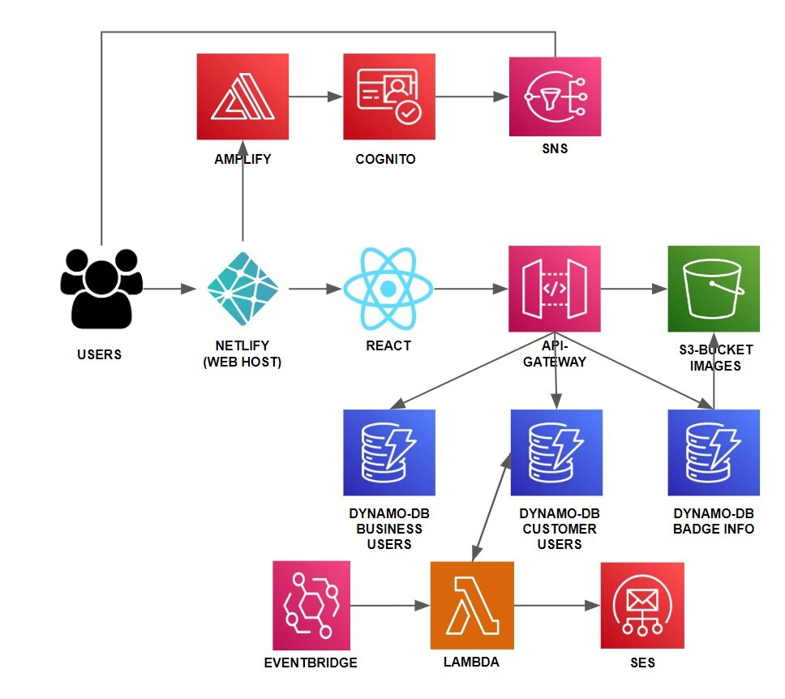

# Elite Managing


Developed by: [Yaakov Stein](https://www.linkedin.com/in/yaakov-s-79a598ab/), [Yosef Teitelbaum](https://www.linkedin.com/in/joseph-teitelbaum-b60366231/), [David Kohanchi](https://www.linkedin.com/in/david-kohanchi/), and [Sam Shulman](https://www.linkedin.com/in/sam-shulman/)

Mentor: [Alex Porcelain](https://www.linkedin.com/in/alexporcelain/)

We are a team of undergraduate students at Yeshiva University studying Computer Science. We developed this customer relationship management application during Summer 2022.

Due to the Covid-19 pandemic, the customer relationships that were so critical to the success of so many small businesses were decimated. This application allows businesses to rebuild that connection and customer loyalty while enjoying a seamless user experience.

This app is written in React and uses Amplify, Amazon Cognito, Amazon DynamoDB, Amazon S3 and API Gateway.

## Architecture Diagram



## Netlify

We took advantage of the Netlify deployment platform to deploy this application. To take a closer look at netlify click [here](https://www.netlify.com/).

## React 🧑‍💻

We used React to build all the front-end components and to implement routing for the app. If you do not have Node.js installed already follow the installation instructions [here](https://nodejs.org/en/download/)
1. Create your own React App by running the following commands in your terminal.
```
npx create-react-app <my-app-name>
```
2. Change directories to your apps root directory.
```
cd <my-app-name>
```
3. Start the app on port 3000
```
npm start
```
## Storage
Firstly, make yourself an AWS account, head over to the AWS console, and create three DynamoDB tables with the following names(Feel free to change the names of the databse, but if you do, make sure to change the corresponding JSON data in the code as well):
1. BusinessUserDB
2. CustomerUserDB
3. BadgeDB

Secondly, you'll need to create an S3 bucket to store your images. Feel free to call it whatever you like.

## API Gateway 🌉
To set up the necessary API-Endpoints you are going to need to create an IAM role that has access to the following permissions -
1. Ability to get, put, delete, update, and scan data from a DynamoDB table.
2. Has access to API-Gateway
3. Has ability to put and get objects from the S3 bucket.
   Using that IAM role, create the GetItem, PutItem, DeleteItem, UpdateItem, and Scan methods under an API that you have created in API-Gateway. Deploy the stage and copy the proper API endpoint that is displayed (the invoke URL) to the proper places in the code.

## Cognito 🔐
We used Cognito to handle user authentication. In order to set up the necessary user pools do the following:
1. Navigate the [AWS Cognito Console](https://us-east-1.console.aws.amazon.com/cognito/v2/idp/user-pools?region=us-east-1)
2. Click on create user pool
3. In the configure sign-in experience page under sign in options select Username and Email
4. On the next page under Multi-factor authentication select No MFA
5. On the next page leave all the default settings
6. Under configure message delivery select send email with Cognito
7. Under user pool name enter business pool

Repeat these steps to make a customer user pool


## Amplify
We used Amplify and Amplify Studio to create and continuously run a backend for our application. Amplify stores the backend environment in an instance of an S3 bucket (described above). Amplify is also configured to allow for the google maps rendering within each business card.

## Microservices ƛ
We created a microservice using a lambda function to email customers once a month with the featured badge of the month. To configure this microservice do the following:
1. Navigate to the [AWS Lambda Console](https://us-east-1.console.aws.amazon.com/lambda/home?region=us-east-1#/discover)
2. Click create function
3. Under function name enter a name for your function then click create function
4. Click add trigger
5. In the trigger configuration drop down select EventBridge
6. Select create new rule, give it a rule name, select schedule expression and enter the [Cron expression](https://docs.aws.amazon.com/eventbridge/latest/userguide/eb-create-rule-schedule.html) of your choice and click add.
7. Create the [Microservices Directory](https://github.com/shulman33/new-crm/tree/main/microservices) on your computer
8. Zip the folder then in the lambda console click upload from .zip file

## Installation
1. Clone this repo locally.
```
git clone https://github.com/shulman33/new-crm.git
```
2. Create the necessary [storage](#storage) structure for the backend of the website.
    1. Set up the 3 databases.
    2. Set up the S3 bucket.
3. Create and deploy the [API endpoints](#api-gateway-) to access the databases and the S3 bucket.
    1. Add the API endpoints to the necessary locations in the code.
4. Set up the [user pools](#cognito-) to properly handle sign-ins and authentication on the website.
5. If you plan on using this web-app long term, you may want to add our [microservice](#microservices-) to send an email once a month.
6. Open the command line, and navigate into the repo. Run npm install to install the necessary dependencies.
```
npm install
```
7. To start using the web-app, run npm start from the command line.
``` 
npm start 
```
8. If you wish to deploy your application to the web, you can do so however you like, but we recommend using [Netlify](#netlify).