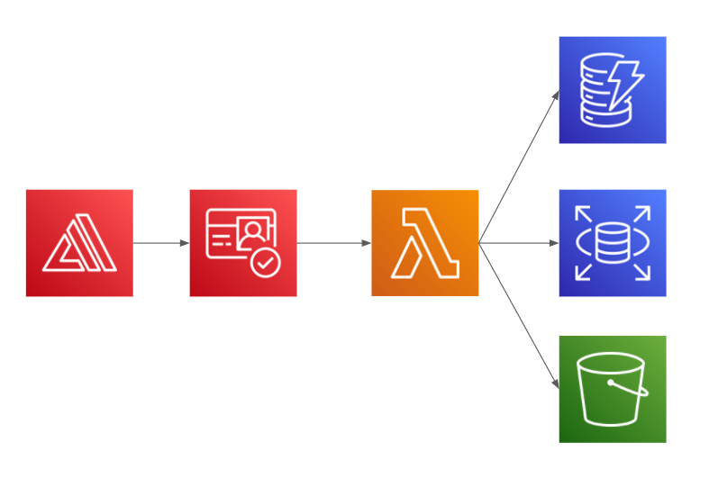

# Elite Managing

Developed by: [Yaakov Stein](https://www.linkedin.com/in/yaakov-s-79a598ab/), [Yosef Teitelbaum](https://www.linkedin.com/in/joseph-teitelbaum-b60366231/), [David Kohanchi](https://www.linkedin.com/in/david-kohanchi/), and [Sam Shulman](https://www.linkedin.com/in/sam-shulman/)

Mentor: [Alex Porcelain](https://www.linkedin.com/in/alexporcelain/)

We are a team of undergraduate students at Yeshiva University studying Computer Science. We developed this customer relationship management application during Summer 2022.

Due to the Covid-19 pandemic, the customer relationships that were so critical to the success of so many small businesses were decimated. This application allows businesses to rebuild that connection and customer loyalty while enjoying a seamless user experience.

This app is written in React and uses Amplify, Amazon Cognito, Amazon DynamoDB, Amazon S3 and API Gateway.

## Architecture Diagram

